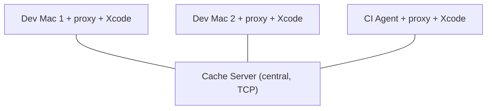
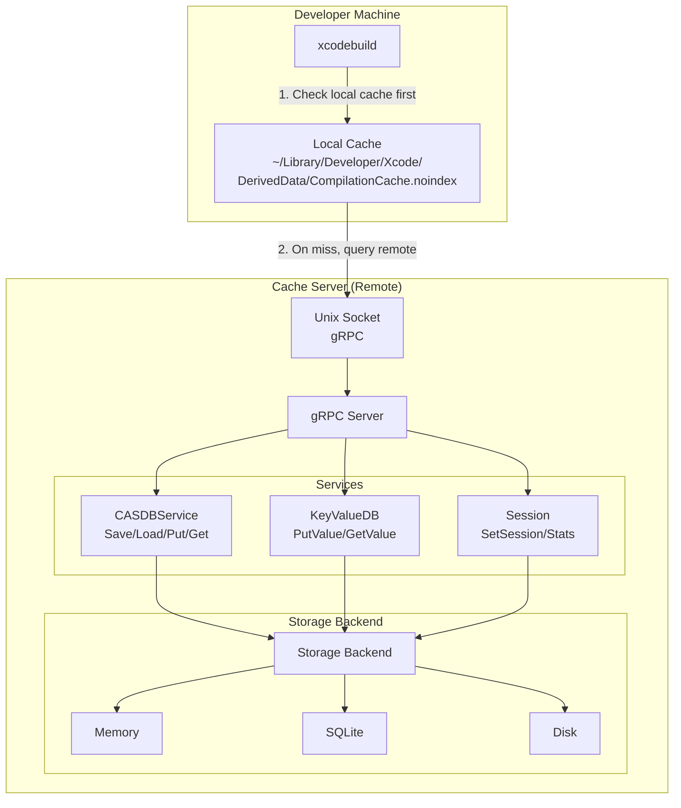

Xcode 26 introduced [compilation caching](https://developer.apple.com/documentation/xcode-release-notes/xcode-26-release-notes#New-Features).

> New Features
> Compilation caching has been introduced as an opt-in feature, which speeds-up iterative build/test cycles for Swift and C-family languages. The compilation caching feature caches the results of compilations that were produced for a set of source file inputs and, when it detects that the same set of source files are getting re-compiled, it speeds-up the build by providing the prior compilation results directly from the cache. The workflows that will benefit the most from compilation caching are when switching between branches (which ends up re-compiling the same source files again) or when doing clean builds.

> Compilation caching can be enabled via “Enable Compilation Caching” build setting or via the per-user project settings. (149700201)

This is a built-in way to skip redundant compilation by reusing previously compiled artifacts. At my company we are in a place where we're too small to use Bazel, but large enough that compile time is a problem. So I take any opportunity to speed things up with the default Xcode tools.

Seeing this feature in Xcode made my eyes light up, I also noticed there is an opportunity to use a remote server because of this `COMPILATION_CACHE_REMOTE_SERVICE_PATH=/tmp/xcode-cache.sock` which allow the cache server to be hosted remotely and accessed via a unix socket.

I started a vibe code journey to see how much gains I could get for my team by building a python based caching server. I built an open source python server called [**XcodeRemoteCache**](https://github.com/amleszk/XcodeRemoteCache). This can allow teams to have a Bazel-like experience without paying the high cost of using Bazel.

Companies like Slack and Reddit have talked publicly about their Bazel migrations for iOS ([Slack's migration to Bazel](https://www.youtube.com/watch?v=L0J2QoZwVPc), [Reddit's journey to Bazel](https://www.youtube.com/watch?v=zgoX1r88FIo)) and if you are at all interested in CICD you should know about this tool. But these are big organizations with dedicated build infrastructure teams. Adopting Bazel on an iOS project means replacing Xcode's build system entirely (with some synchronization tools) and rewriting your build configuration in Starlark.

## How It Works

Under the hood, Xcode 26+ uses a [gRPC-based protocol](https://github.com/swiftlang/llvm-project/tree/next/llvm/lib/RemoteCachingService) defined in Apple's LLVM fork to talk to a cache service.

CAS stands for Content Addressable Storage which is [explained on the LLVM page](https://llvm.org/docs/ContentAddressableStorage.html)

## Journey to feasability

Shortly after implementing the gRPC server i noticed a flaw in the protocol where the uploaded CAS files would fail because the gRPC call assumes the cache server is hosted on the same machine, and sends an absolute file path which references to a non-existent file. This seemed like a hard blocker for the remote cache but it seems like there is a workaround. Users on the swift forum also dicovered the same problem. [Swift thread here](https://forums.swift.org/t/about-swift-shared-cache-across-machines/81850/14).

I can't take credit though, Claude code came up with a genius workaround whereby a proxy server can be run on the 'follower' machine which intercepts the file based gRPC request and reads the file and sends raw bytes to the remote server. Then the remote server has no dependency on the file path existing.

The full architecture diagram is below. For more information you can view the project here [**XcodeRemoteCache**](https://github.com/amleszk/XcodeRemoteCache)

## Performance benchmarks

To measure performance I created a matrix of compilation builds on our hosted infrastructure. We run 12 macs, each co-lated in a cluster. The performance gains were significant. I saw about 30% reduction in compile time.

## Issues with [periphery](https://github.com/peripheryapp/periphery)

I ran into problems with one of the third party tools we rely on for detecting dead code [https://github.com/peripheryapp/periphery](https://github.com/peripheryapp/periphery). Dead code can slow down the compilation process in 2 distinct ways. First is the obvious one, that extra code needs to be compiled when it's a downstream dependency of changed code. The second reason is less obvious one, unused imports. If swift file `A.swift` imports a module and doesn't use it, it still needs to be compiled when that imported module changes. This can have a large impact on compile times.

The periphery issue is a hard blocker for using this approach at my company.

**Links:**

- [Xcode 26 Release Notes](https://developer.apple.com/documentation/xcode-release-notes/xcode-26-release-notes)
- [LLVM CAS Protocol](https://github.com/swiftlang/llvm-project/tree/next/llvm/lib/RemoteCachingService)
- [Bitrise Build Cache CLI](https://github.com/bitrise-io/bitrise-build-cache-cli)
